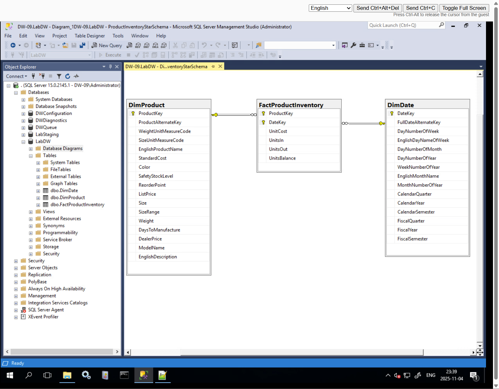

# Lab 1: Dimensional Modeling & Star Schema

## 🎯 Objective
Design and implement a relational data warehouse schema in **MS SQL Server**.

## 🚀 Core Implementation
* **Schema Design:** Created `DimProduct`, `DimDate`, and `FactProductInventory` tables using T-SQL.
* **Key Constraints:** Established composite primary keys (`ProductKey` + `DateKey`) and foreign key relationships to ensure referential integrity.
* **Validation:** Generated a SQL Server Database Diagram to visually validate the Star Schema architecture.

## 📊 Schema Diagram
**
