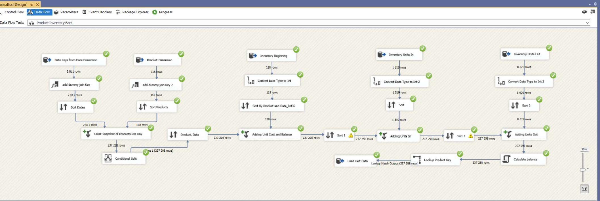

# Lab 2: ETL Pipeline Development with SSIS

## 🎯 Objective
Build an end-to-end **ETL pipeline** using **SSIS** to extract data from flat files, transform it, and load it into the data warehouse.

## 🚀 Core Implementation
* **Data Cleansing:** Handled NULL values and data type conversions using *Derived Column* and *Data Conversion* components.
* **Slowly Changing Dimensions (SCD):** Configured **SCD Type 1 and Type 2** for the Product dimension to track historical attribute changes.
* **Fact Table Loading:** Merged dimension data, retrieved surrogate keys via *Lookup*, and generated daily inventory snapshots.
* **Pipeline Debugging:** Utilized *Row Sampling* and *Data Viewers* to validate data transformations before the final load.

## 📊 SSIS Pipeline Execution
**
