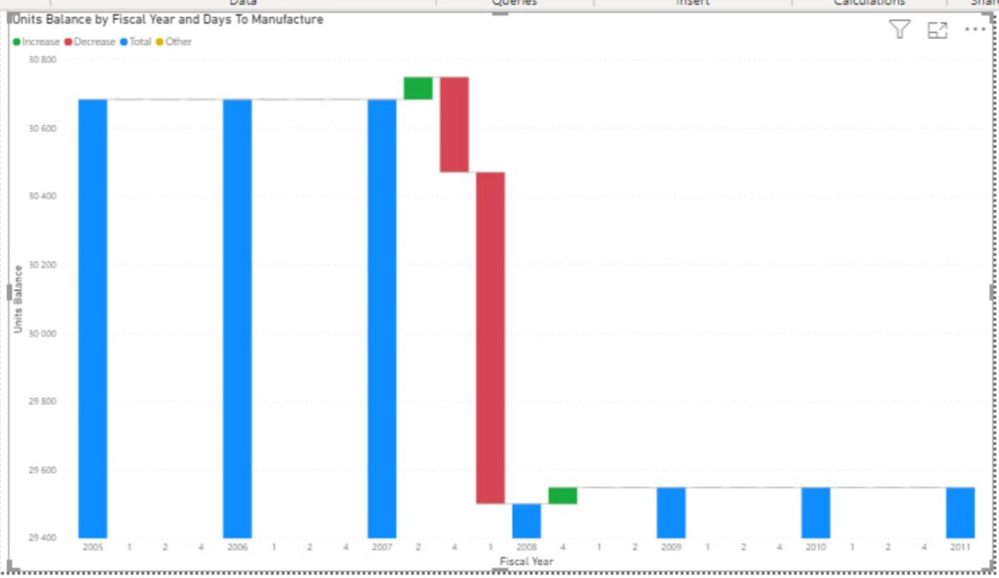
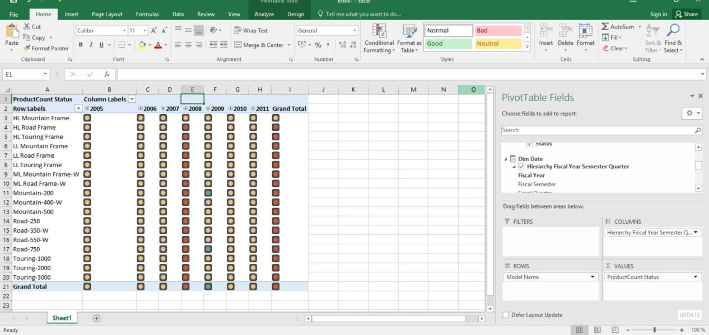

# Lab 3: OLAP Cube & Multidimensional Analysis

## Objective
Transform the relational data warehouse into an **OLAP Cube** using **SSAS**, query data via **MDX**, and build visualizations in **Power BI** and **Excel**.

## Core Implementation
* **Multidimensional Modeling:** Built Date and Product dimensions with custom hierarchies (e.g., Fiscal Year-Semester-Quarter) and attribute relationships.
* **MDX & KPIs:** Authored **MDX** calculated members (e.g., *Period over Period Growth*) and defined status indicator KPIs (traffic lights) for inventory monitoring.
* **Data Visualization:** Connected the SSAS cube to **Power BI** (e.g., Waterfall charts for inventory fluctuations) and **Excel** PivotTables for dynamic multidimensional analysis.

## Visualizing the Insights

### Power BI Inventory Waterfall Chart

### KPI Monitoring in Excel

